# CSV Ingestion Pipeline — S3 → Lambda → Glue Workflow → S3

This project was built in two phases:

1. **Manual build** — every resource created by hand in the AWS Console, to
   understand how each piece works and connects.
2. **Automated build** — the same architecture rebuilt as CloudFormation
   (Infrastructure as Code) and deployed/destroyed via GitHub Actions CI/CD.

## Architecture

```
S3 (input bucket, .csv uploaded)
   → S3 Event Notification (ObjectCreated, prefix/suffix filtered)
   → Lambda function (starts Glue Workflow run)
        → Glue Workflow
             1. Crawler        → catalogs input CSV schema (Glue Data Catalog)
             2. Glue ETL Job   → transforms data (Python Shell), writes to output S3
   → CloudWatch Logs (Lambda, Crawler, Job)
```

Two datasets flow through this pipeline: `movies.csv` and `ratings.csv`. The ETL job joins them and computes an
average rating per movie.

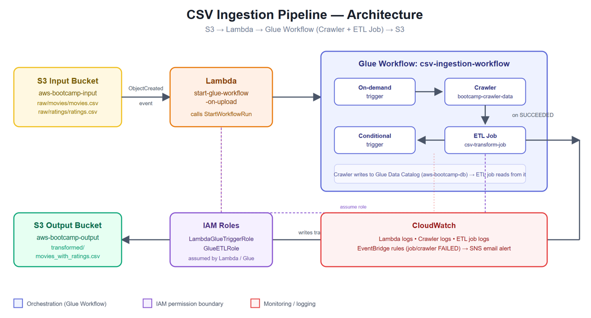
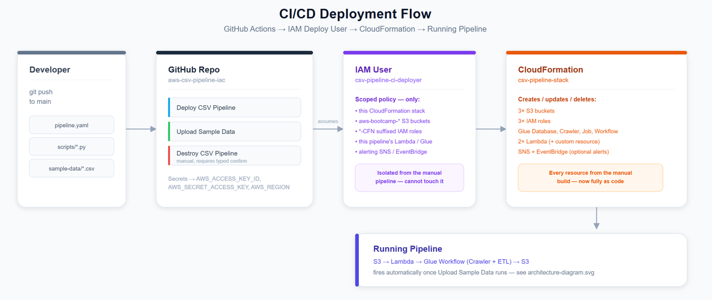
---

# Part 1 — Manual Build

Every resource below was created directly in the AWS Console, in this order.

## 1.1 S3 Buckets

Created two buckets:
- `aws-bootcamp-input` — source CSVs land here, under `raw/<dataset>/`
- `aws-bootcamp-output` — transformed results land here, under `transformed/`

**Validation**: both buckets visible in S3 console, default settings
(Block Public Access enabled).

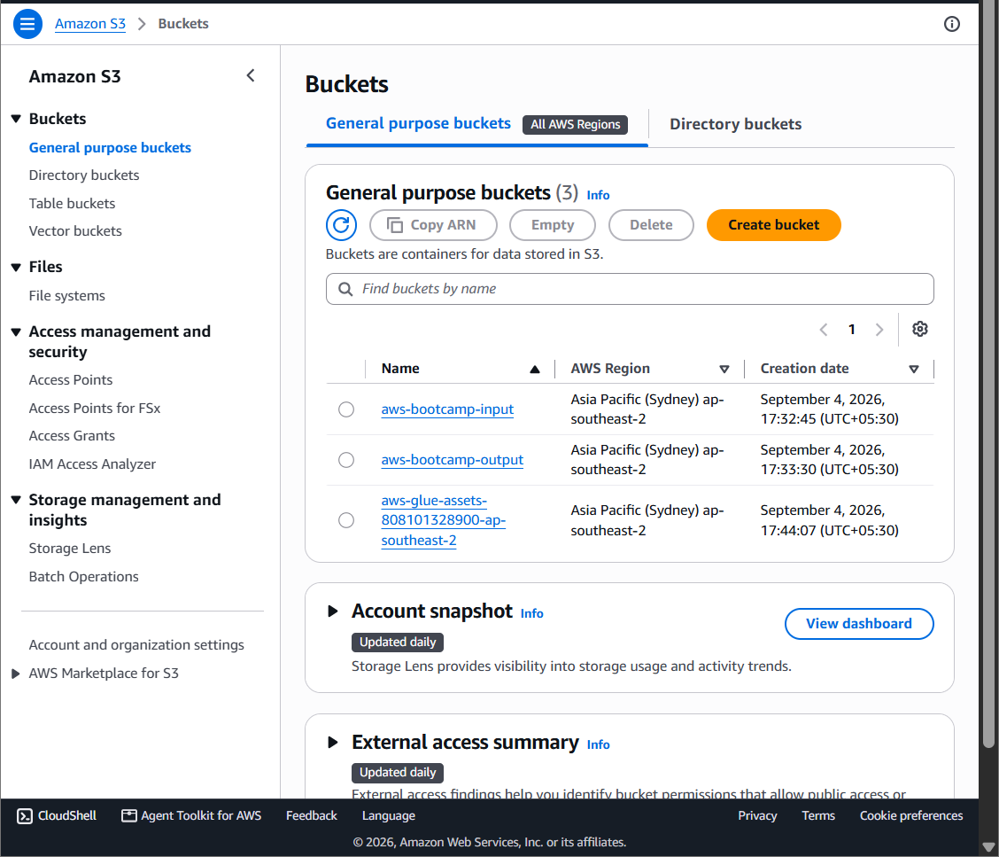


## 1.2 IAM Roles

Two roles, created via **IAM → Roles → Create role**:

| Role | Trusted service | Key permissions |
|---|---|---|
| `LambdaGlueTriggerRole` | Lambda | `glue:StartWorkflowRun`, `glue:GetWorkflowRun`, `s3:GetObject` on input bucket |
| `Glue-role-af74499e` (Glue's auto-created role, reused) | Glue | `AWSGlueServiceRole` managed policy + inline S3 read/write on input + output buckets |

**Validation**: both roles show correct trust relationships (`lambda.amazonaws.com`
/ `glue.amazonaws.com`) and the expected inline/managed policies attached.

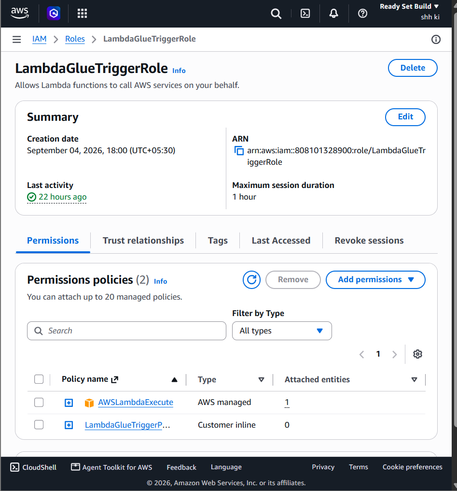
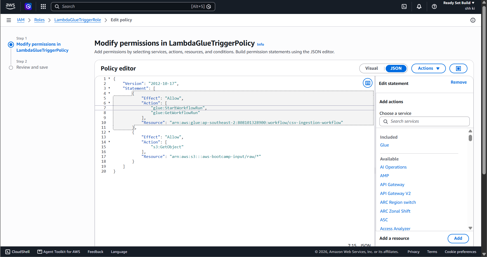
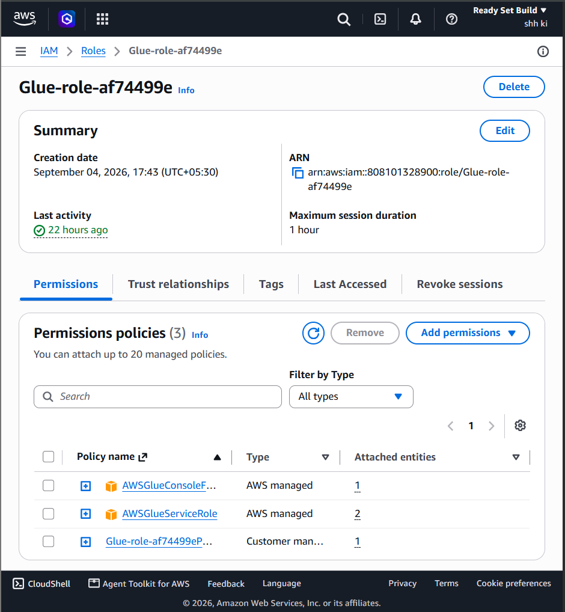

## 1.3 Glue Data Catalog Database

Created database `aws-bootcamp-db` under **Glue → Data Catalog → Databases**.

## 1.4 Glue Crawler

Created `bootcamp-crawler-data`, pointed at `s3://aws-bootcamp-input/raw/`,
targeting `aws-bootcamp-db`, using the Glue IAM role above. Schedule set to
**On demand** (the Workflow triggers it, not a cron schedule).

**Validation**: ran the crawler manually once — it succeeded and created
two separate tables, `movies` and `ratings`, correctly split because each
dataset lives in its own subfolder (`raw/movies/`, `raw/ratings/`).

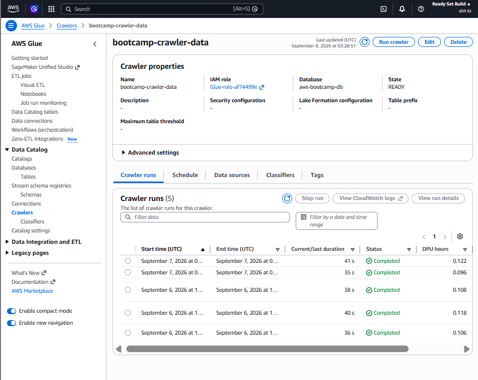
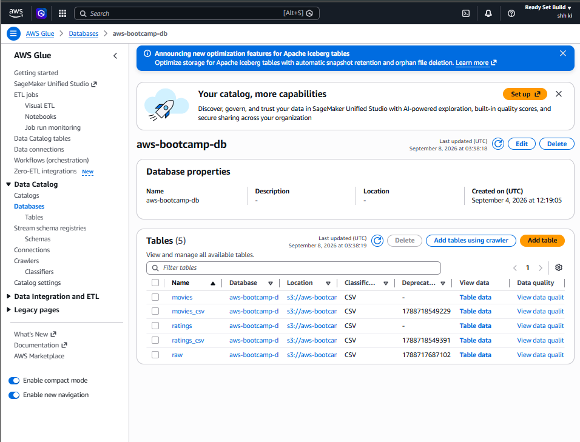

## 1.5 Glue ETL Job (Python Shell)

Created `csv-transform-job` as a **Python Shell** job. The script:
- Reads `movies.csv` and `ratings.csv` directly from S3 with pandas
- Computes average rating + rating count per movie (`groupby` + `agg`)
- Joins that back onto the movie metadata
- Writes `movies_with_ratings.csv` to the output bucket

**Validation**: ran the job manually — succeeded, and
`movies_with_ratings.csv` appeared in the output bucket with correct
`avg_rating`/`num_ratings` columns.

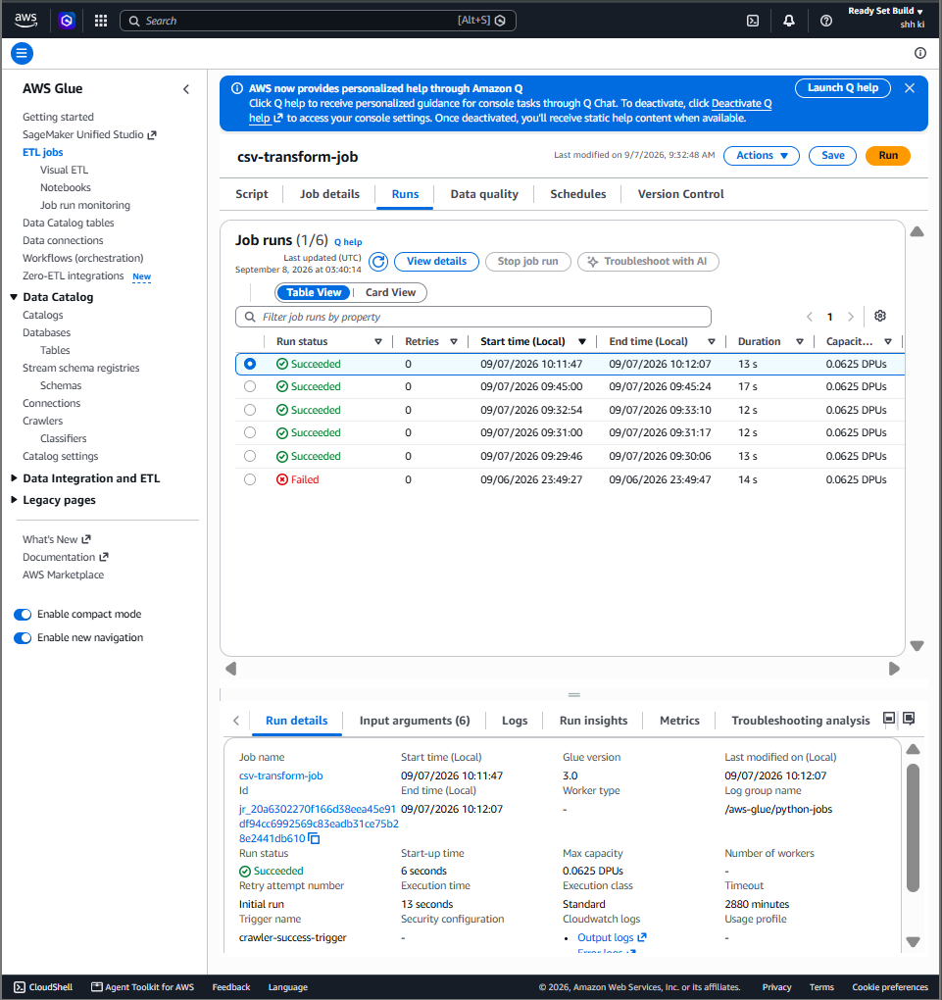


## 1.6 Glue Workflow (orchestration)

Created `csv-ingestion-workflow` to chain the crawler and job together:
- **Trigger 1** (`start-workflow-trigger`): On-demand → runs `bootcamp-crawler-data`
- **Trigger 2** (`crawler-success-trigger`): Conditional, fires when the
  crawler reaches `SUCCEEDED` → runs `csv-transform-job`

**Validation**: ran the whole workflow manually (not the individual
pieces) — the graph showed crawler → job running in sequence, both
succeeding, with fresh output in S3 afterward.

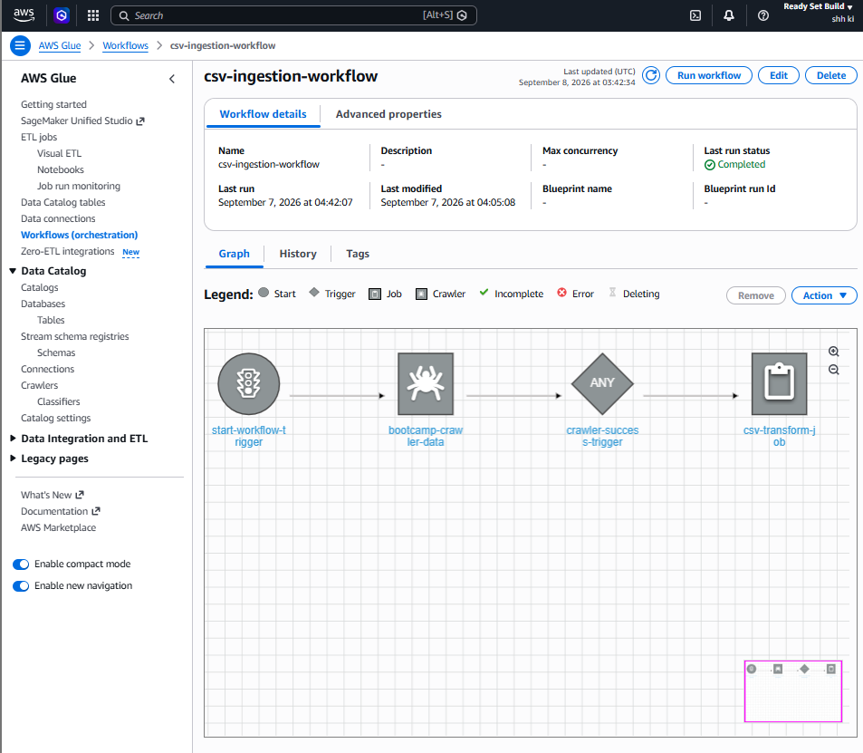
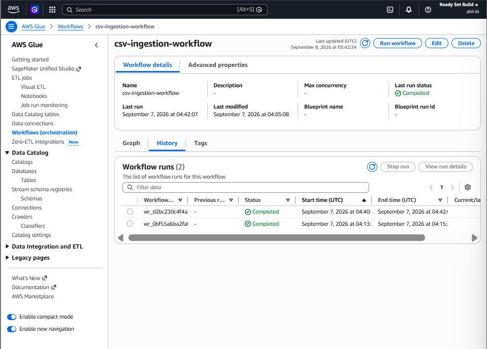

## 1.7 Lambda Function + S3 Trigger

Created `start-glue-workflow-on-upload` (Python 3.12), using
`LambdaGlueTriggerRole`. The function starts the Glue Workflow whenever an
S3 event fires for a `.csv` file:

```python
import boto3

glue = boto3.client("glue")
WORKFLOW_NAME = "csv-ingestion-workflow"

def lambda_handler(event, context):
    for record in event["Records"]:
        key = record["s3"]["object"]["key"]
        if key.lower().endswith(".csv"):
            response = glue.start_workflow_run(Name=WORKFLOW_NAME)
            print(f"Started workflow run {response['RunId']} for file {key}")
    return {"statusCode": 200}
```

Added an **S3 trigger** on `aws-bootcamp-input`, scoped to prefix `raw/`,
suffix `.csv`.

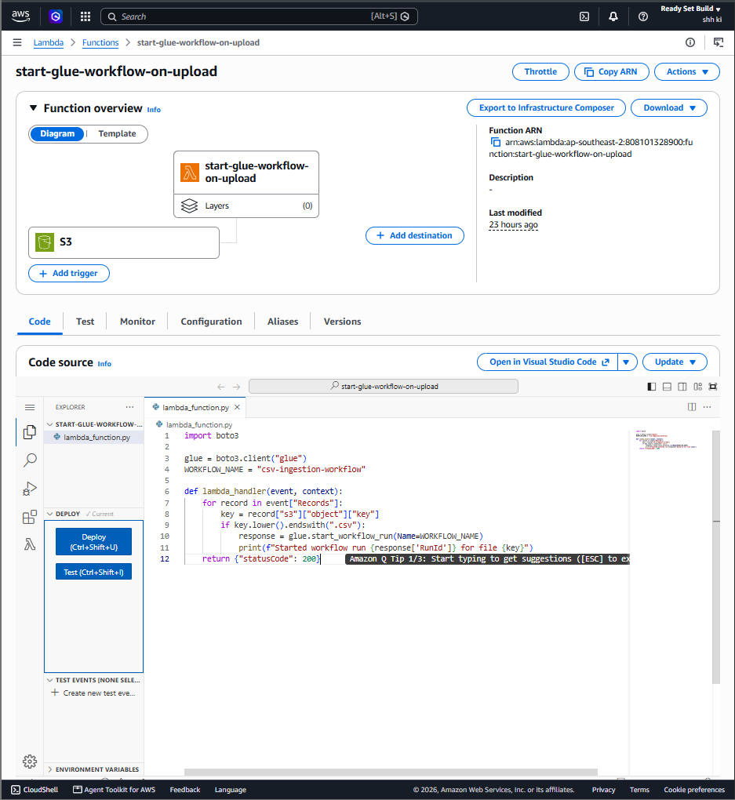


## 1.8 End-to-End Manual Validation

Uploaded `movies.csv` then `ratings.csv` directly to
`s3://aws-bootcamp-input/raw/...` (not through any manual "Run" button) and
confirmed the entire chain fired automatically:

1. **Lambda CloudWatch logs** — showed `Started workflow run <id> for file
   raw/ratings/ratings.csv`.
2. **Glue Workflow History** — a new run appeared automatically (not
   manually triggered), crawler → job both succeeded.
3. **S3 output bucket** — fresh `movies_with_ratings.csv`.

This confirmed the manually-built pipeline worked fully automatically:
**S3 upload → Lambda → Glue Workflow → transformed output**, no manual
intervention needed after the upload.

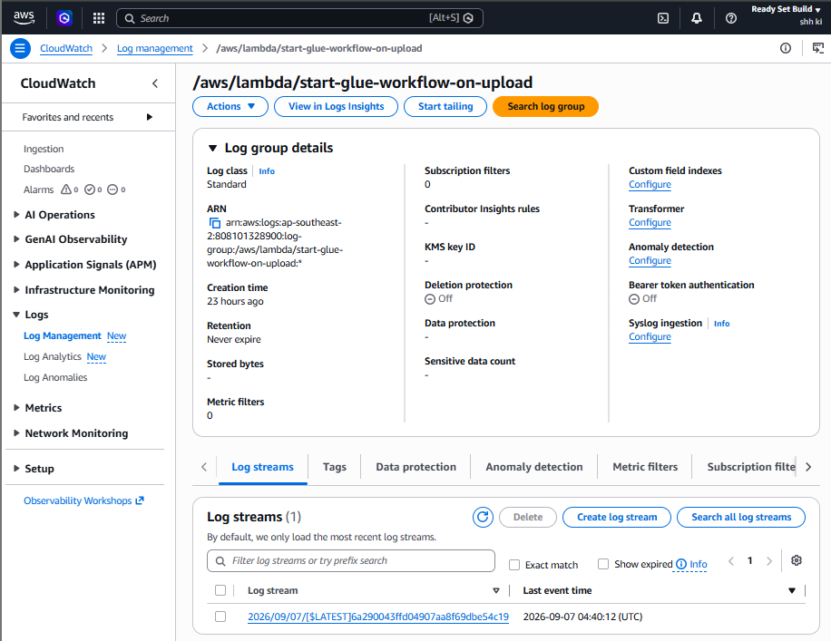


---

# Part 2 — Automated Build (Infrastructure as Code + CI/CD)

The same architecture, rebuilt as code so it can be deployed, updated, and
destroyed repeatably — with a completely separate, isolated set of
resources (`-v2` suffix, separate IAM user) so it never touched the manual
build above.

## 2.1 CloudFormation Template

`pipeline.yaml` defines every resource from Part 1, plus:
- A **custom resource** (a small helper Lambda) to wire the S3 → Lambda
  event notification, since `AWS::S3::Bucket` can't reference a Lambda
  ARN that depends on the bucket without a circular dependency.


**Parameters** let bucket/database/workflow names be overridden; defaults
use a `-v2` suffix to avoid colliding with the manually-built resources.

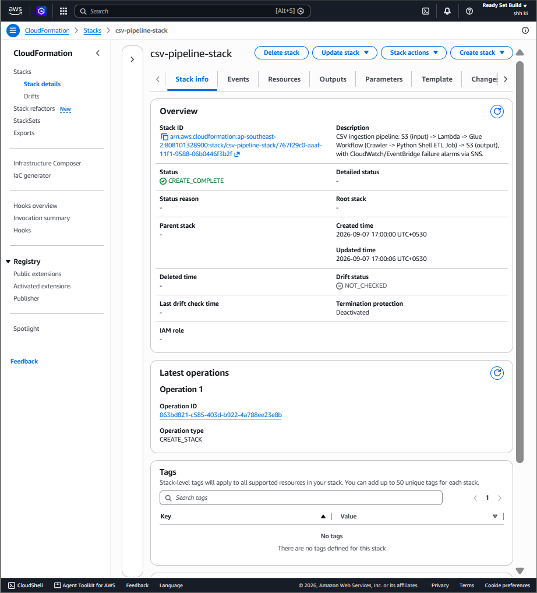

## 2.2 Dedicated IAM Deploy User

Created `csv-pipeline-ci-deployer` — a **separate IAM user**, scoped to a
custom policy (`iam/deploy-user-policy.json`) that only allows managing:
- This specific CloudFormation stack (`csv-pipeline-stack`)
- Buckets matching `aws-bootcamp-*`
- The `-CFN`-suffixed IAM roles
- Lambda functions/Glue resources matching this pipeline
- The alerting SNS topic/EventBridge rules

This user's access keys were added as **GitHub Secrets**
(`AWS_ACCESS_KEY_ID`, `AWS_SECRET_ACCESS_KEY`, `AWS_REGION`) — never
committed to the repo.

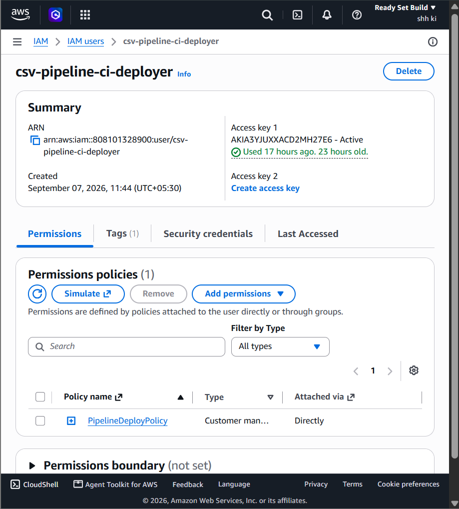
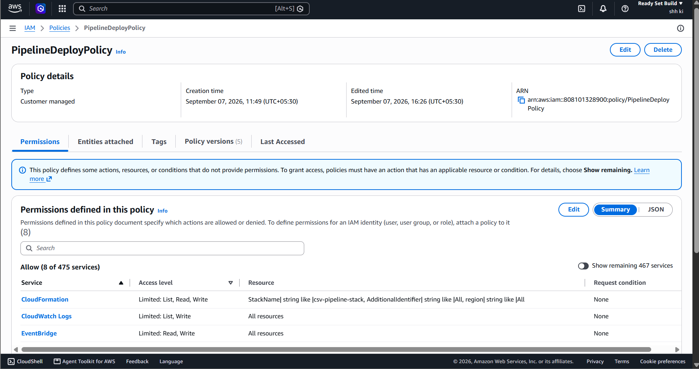
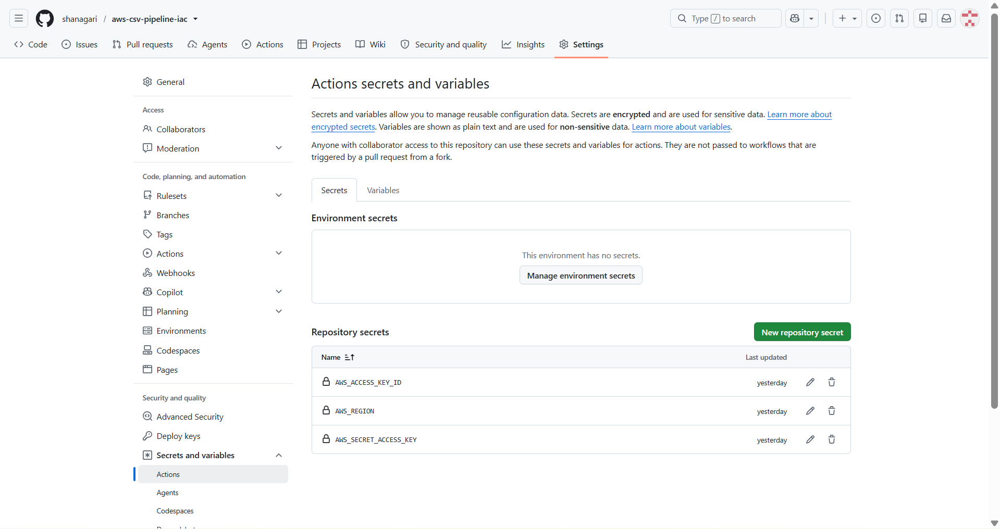

## 2.3 Three GitHub Actions Workflows

| Workflow | Trigger | Purpose |
|---|---|---|
| **Deploy CSV Pipeline** | push to `pipeline.yaml`/`scripts/**`, or manual | Provisions/updates infrastructure only |
| **Upload Sample Data** | push to `sample-data/**/*.csv`, or manual | Uploads only the changed CSV(s) to the matching `raw/<dataset>/` path — decoupled from infra changes |
| **Destroy CSV Pipeline** | manual only, gated behind typing `destroy` | Empties buckets, deletes the entire stack |

Data upload is deliberately **separate** from infra deploy: redeploying
infrastructure shouldn't re-trigger a data load, and loading new data
shouldn't require touching CloudFormation.

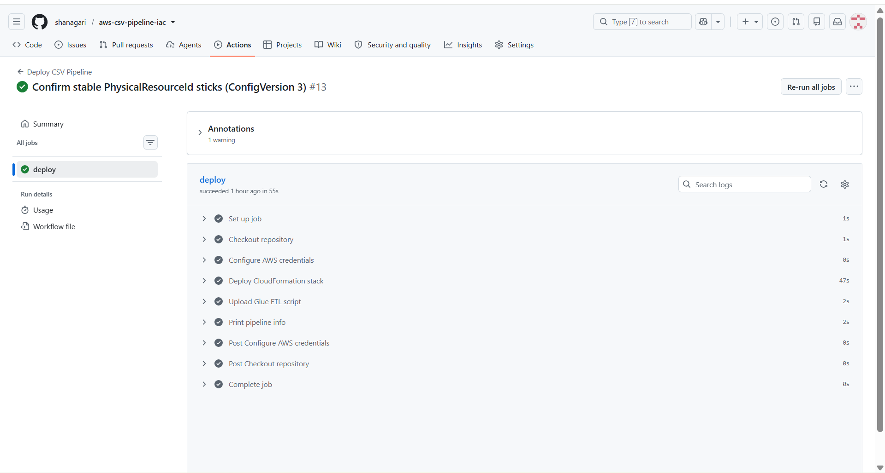
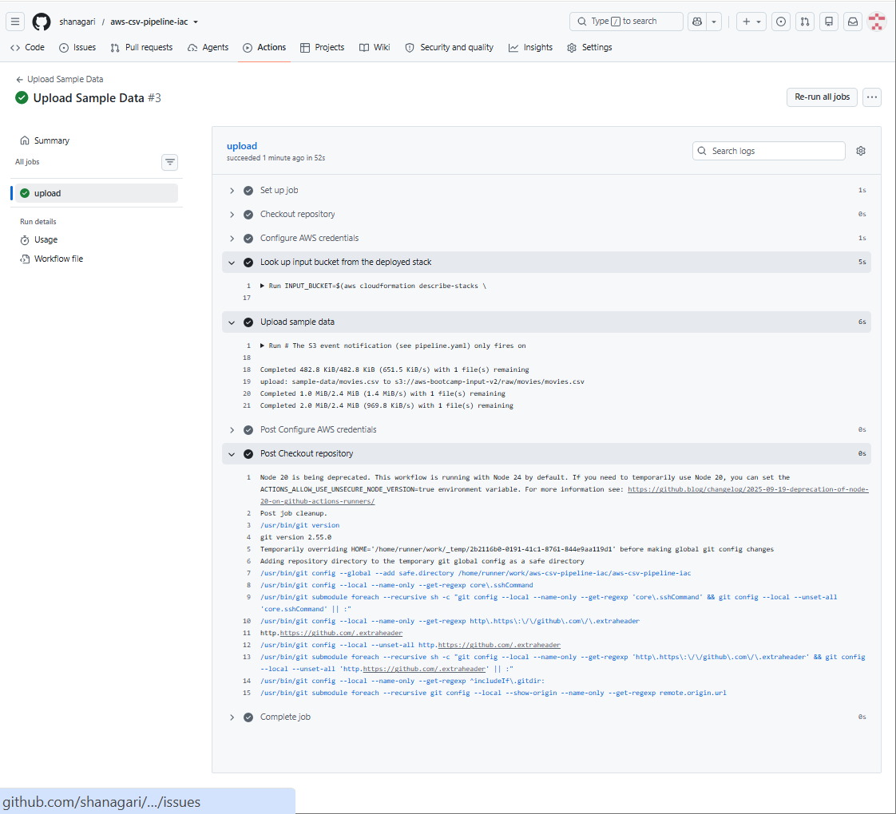

#
## 2.4 End-to-End Validation

**Deploy → Upload → Trigger:**
1. Ran **Deploy CSV Pipeline** — stack created successfully, outputs
   printed (bucket names, workflow name).
2. Confirmed **S3 → Properties → Event notifications** showed exactly 1
   notification, correctly scoped to `raw/ratings/*.csv`.
3. Ran **Upload Sample Data** — uploaded `movies.csv` then `ratings.csv`.
4. Confirmed exactly **one** Lambda invocation (only `ratings.csv` fired
   it), exactly **one** Glue Workflow run, and a fresh
   `movies_with_ratings.csv` in the output bucket.

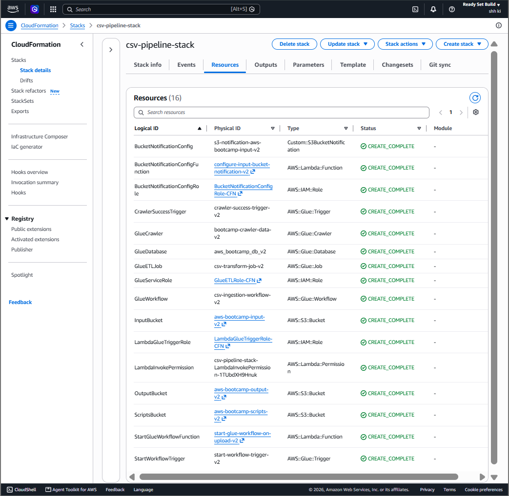


**Destroy → Redeploy (full lifecycle test):**
1. Ran **Destroy CSV Pipeline** with confirmation — all three buckets
   emptied, then the full stack deleted (`DELETE_COMPLETE`).
2. Verified via `aws cloudformation list-stacks --stack-status-filter
   DELETE_COMPLETE` and direct `head-bucket`/`get-function`/`get-role`
   checks that every resource was actually gone, not just the
   CloudFormation record.
3. Ran **Deploy CSV Pipeline** again from the same, unmodified template —
   the entire stack rebuilt cleanly from nothing.
4. Re-ran **Upload Sample Data** and confirmed the pipeline worked
   identically to the first deployment.

This is the real proof point for Infrastructure as Code: the same
template reliably produces the same working system, with no manual
console steps required at any point in the cycle.

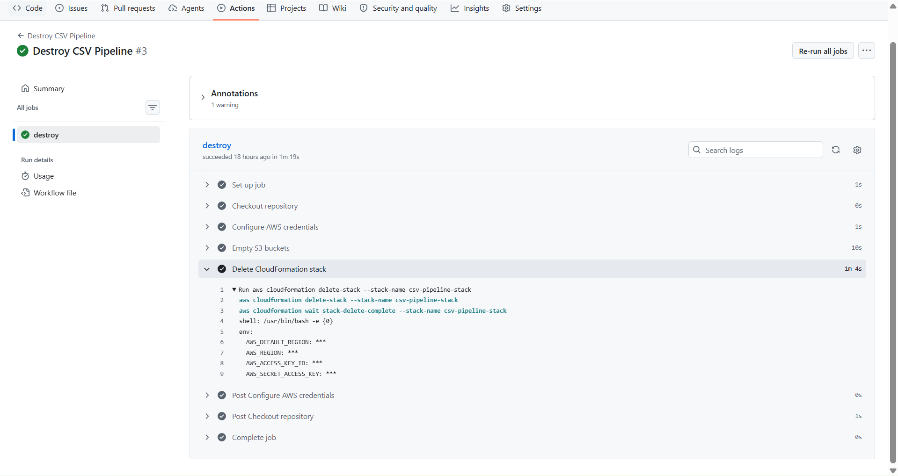)

---

# Summary

| | Manual Build | Automated Build |
|---|---|---|
| **Creation method** | AWS Console, by hand | CloudFormation (`pipeline.yaml`) |
| **Deployment** | One-off | Repeatable via `git push` / GitHub Actions |
| **Data loading** | Manual S3 upload | GitHub Actions, diff-based, decoupled from infra |
| **Teardown** | Manual deletion, resource by resource | One workflow, fully automated |
| **Isolation** | `aws-bootcamp-*` resources | `aws-bootcamp-*-v2` resources, separate IAM user |
| **Validated** | ✅ upload → auto-trigger → transformed output | ✅ deploy → upload → trigger → destroy → redeploy |

Both pipelines demonstrate the same architecture:
**S3 → Lambda → Glue Workflow (Crawler + ETL) → S3**, with CloudWatch
logging throughout. The automated version adds full lifecycle
repeatability and removes any manual AWS Console steps from normal
day-to-day operation.